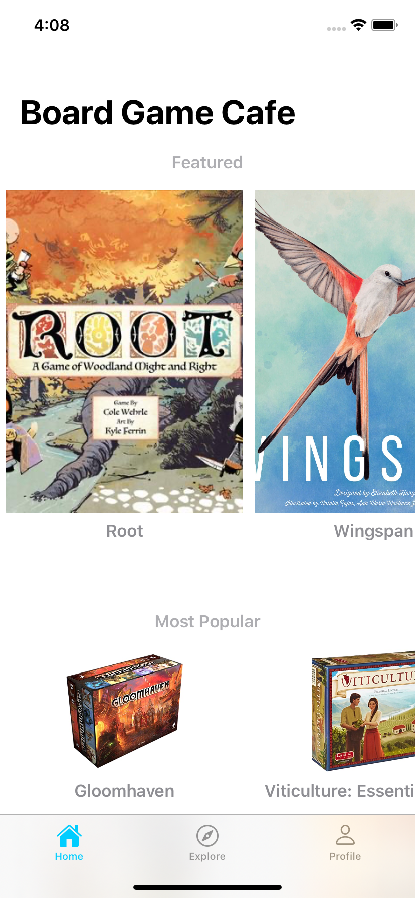
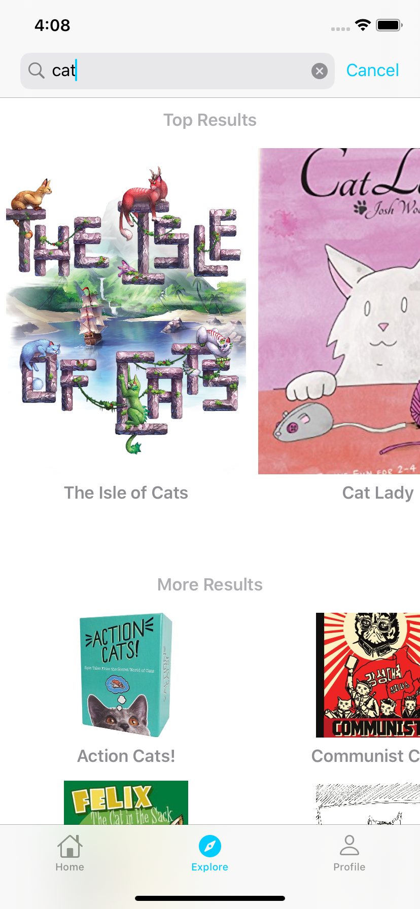
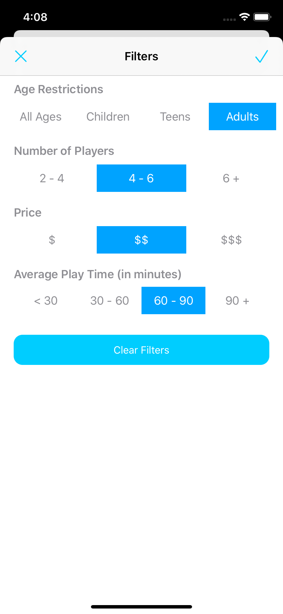
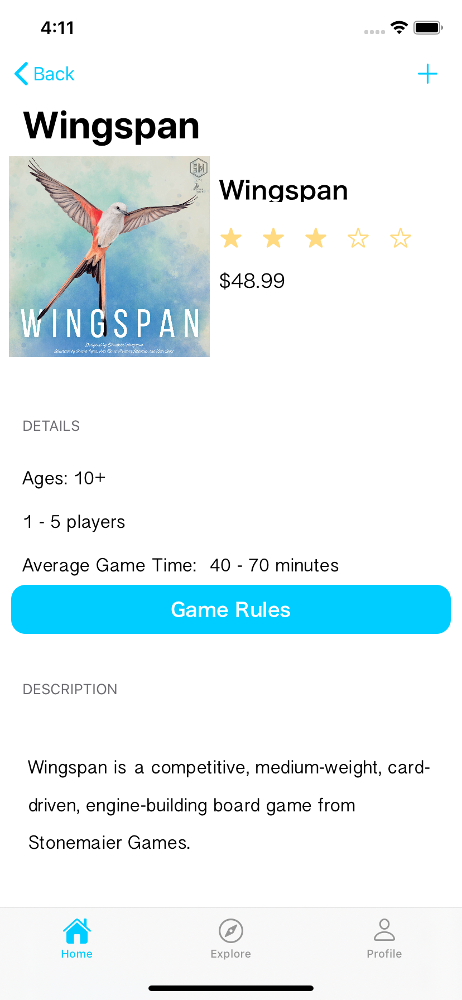
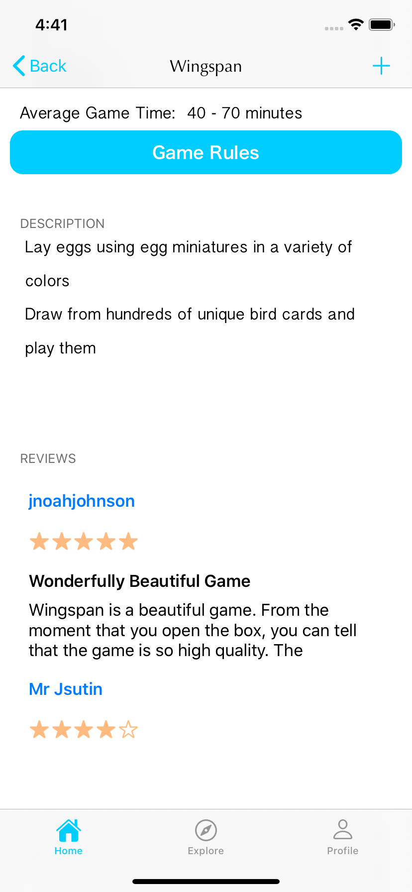
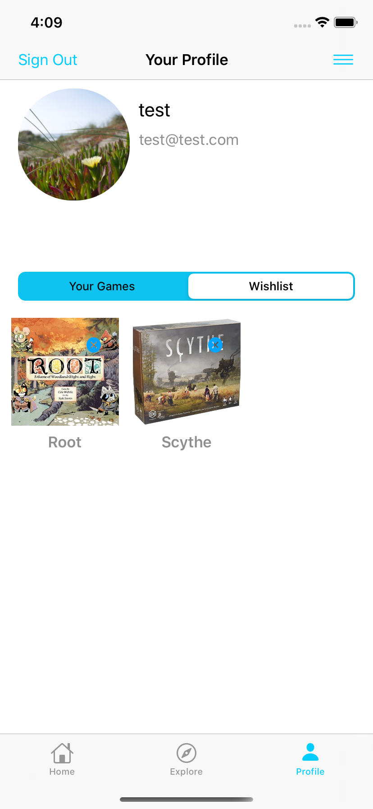

# Board Game Cafe

An iOS app for board game fanatics and newbies to search for new products, read reviews, and save games to their collection

## Home Page
Browse through the home page for the latest realses, most popular and recommended lists of board games

## Explore Page
Search for games by name on the explore page

Or apply filters

## Game Detail Page
Find out more about a game through the detail page.
- Read game specs such as number of players or average playtime
- Read reviews left by other users
- Add or remove a game to your collection

## Profile
See your **My Games** and **Wishlist** collections on your profile page

### Tools & Frameworks used
Xcode 11, Swift 5, UIKit, Foundation, Firebase, SafariKit
### API
This app used the [Board Game Atlas] API(https://www.boardgameatlas.com/api/docs)
### Pods
[Kingfisher](https://github.com/onevcat/Kingfisher)
